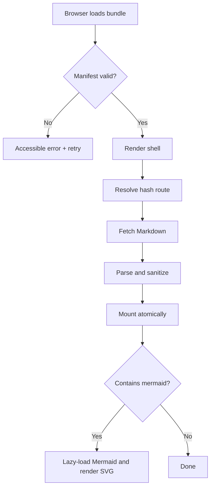
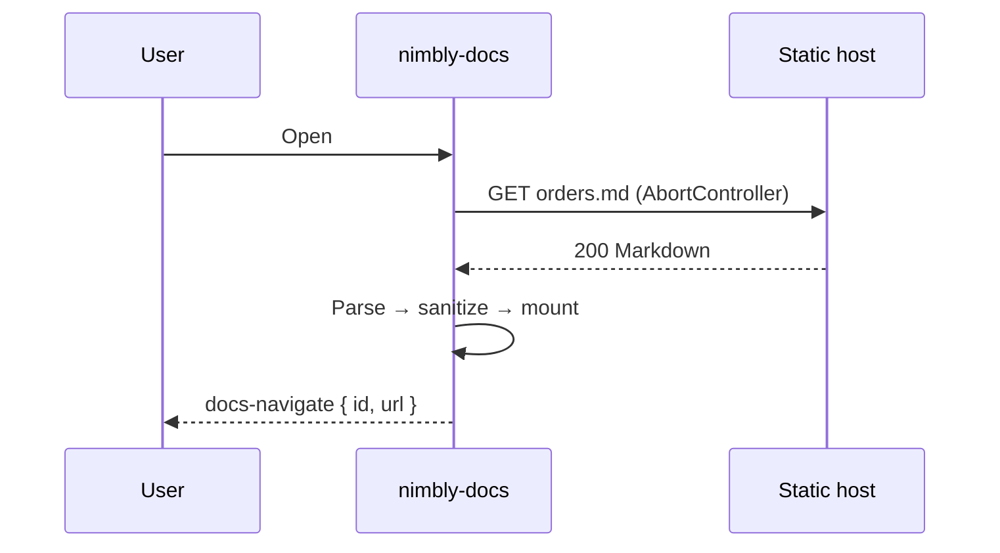
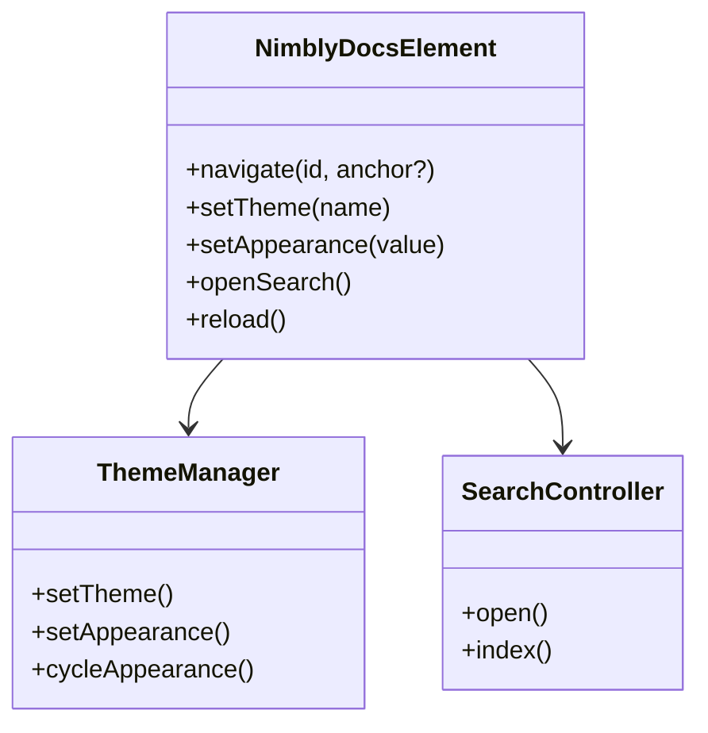
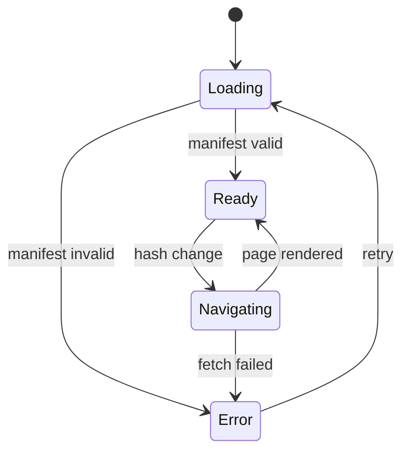

# Diagrams (Mermaid)

Nimbly Docs renders [Mermaid](https://mermaid.js.org/) diagrams from fenced ` ```mermaid ` blocks. Support is **opt-in** so the base bundle stays dependency-free and inside its size budget.

## Enabling it

Add the `mermaid` attribute. Mermaid is then imported lazily from a pinned URL, and only on pages that actually contain a diagram.

```html
<nimbly-docs manifest="./index.json" mermaid="on"></nimbly-docs>
```

Under a strict Content-Security-Policy, self-host the library and point to it:

```html
<nimbly-docs
  manifest="./index.json"
  mermaid="on"
  mermaid-src="/vendor/mermaid.esm.min.mjs">
</nimbly-docs>
```

Diagrams are parsed with Mermaid's `strict` security level, so diagram text cannot execute scripts or inject raw HTML. Diagrams also follow the active light/dark appearance.

## Flowchart



## Sequence diagram



## Class diagram



## State diagram



If a diagram fails to parse, the original code block is preserved so the page is never left blank.
